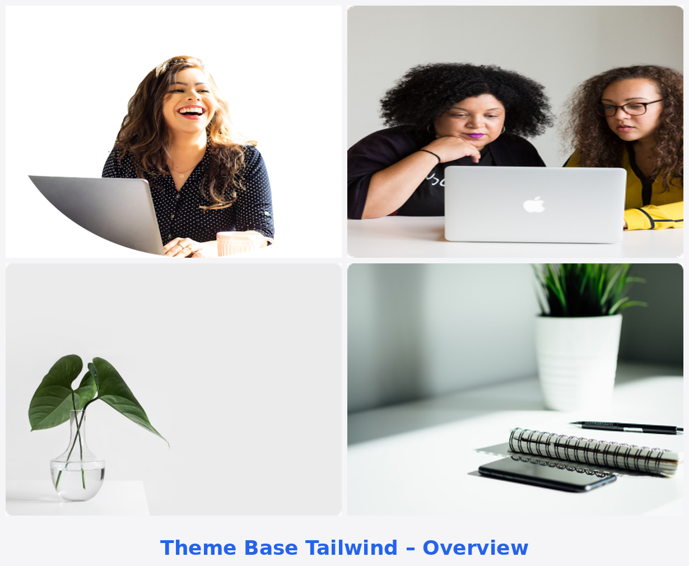

# Comment ajouter des screenshots professionnels

## 📸 Guide pour améliorer la présentation de votre thème

### 1. Prendre des screenshots de qualité

Pour obtenir les meilleures images de présentation :

#### A. Depuis votre instance Odoo locale
1. Installez le thème sur votre instance Odoo 19
2. Personnalisez les contenus (textes, images)
3. Utilisez un outil de capture d'écran de qualité :
   - **Windows** : Snipping Tool, ShareX, Greenshot
   - **Mac** : Cmd+Shift+4
   - **Linux** : Flameshot, Shutter

#### B. Dimensions recommandées
- **Screenshot principal** : 1200 x 800 px (ratio 3:2)
- **Screenshots de détail** : 800 x 600 px minimum
- **Format** : PNG pour la qualité, ou JPEG optimisé (85% qualité)

### 2. Types de screenshots à créer

Créez 4-6 screenshots montrant :

1. **Homepage complète** (main_screenshot.png) - ✅ Déjà fait
2. **Section Hero** - Vue rapprochée de la section d'accueil
3. **Section Services/Features** - Montrant les icônes et descriptions
4. **Section Pricing** - Tables de tarification
5. **Section Portfolio** - Galerie de projets
6. **Version Mobile** - Vue responsive sur smartphone

### 3. Sauvegarder les images

Placez tous vos screenshots dans :
```
theme_tailwind/static/description/images/
```

Nommage recommandé :
- `main_screenshot.png` (homepage complète - déjà présent)
- `hero_section.png` (section hero)
- `services_section.png` (section services)
- `pricing_section.png` (tarifs)
- `portfolio_section.png` (portfolio)
- `mobile_view.png` (version mobile)

### 4. Mettre à jour index.html

Dans `theme_tailwind/static/description/index.html`, ajoutez vos screenshots :

```html
<section class="mb-5">
    <h2 class="h3 font-weight-bold mb-3">Theme Screenshots</h2>
    <div class="row">
        <!-- Screenshot principal -->
        <div class="col-12 mb-4">
            
            <p class="text-center text-muted mt-2"><small>Full homepage preview</small></p>
        </div>

        <!-- Ajoutez vos nouveaux screenshots ici -->
        <div class="col-md-6 mb-4">
            
            <p class="text-center text-muted mt-2"><small>Hero section with CTA</small></p>
        </div>

        <div class="col-md-6 mb-4">
            
            <p class="text-center text-muted mt-2"><small>Services showcase</small></p>
        </div>

        <div class="col-md-6 mb-4">
            
            <p class="text-center text-muted mt-2"><small>Pricing tables</small></p>
        </div>

        <div class="col-md-6 mb-4">
            
            <p class="text-center text-muted mt-2"><small>Mobile responsive design</small></p>
        </div>
    </div>
</section>
```

### 5. Optimiser les images

Avant de commit, optimisez vos images pour réduire leur taille :

#### Outils en ligne :
- TinyPNG.com (PNG)
- Compressor.io (PNG/JPEG)
- Squoosh.app (Google)

#### Outils desktop :
- ImageOptim (Mac)
- FileOptimizer (Windows)
- GIMP (tous systèmes)

**Cible** : Chaque image < 200 KB si possible

### 6. Mettre à jour __manifest__.py

Si vous voulez que d'autres images soient utilisées par Odoo Apps :

```python
'images': [
    'static/description/images/main_screenshot.png',
    'static/description/images/hero_section.png',
    'static/description/images/services_section.png',
    # etc...
],
```

**Note** : La première image sera utilisée comme thumbnail principal.

### 7. Commit et Push

```bash
git add theme_tailwind/static/description/images/*
git add theme_tailwind/static/description/index.html
git commit -m "Add professional screenshots for theme presentation"
git push origin 19.0
```

---

## 💡 Conseils professionnels

1. **Utilisez du contenu réaliste** - Pas de "Lorem ipsum" dans les screenshots
2. **Masquez les éléments de dev** - Pas de debug toolbar visible
3. **Choisissez de belles images** - Utilisez Unsplash.com ou Pexels.com
4. **Cohérence visuelle** - Utilisez la même palette de couleurs
5. **Qualité > Quantité** - 4-5 excellents screenshots valent mieux que 10 moyens

## 🎨 Ressources gratuites d'images

- **Unsplash** : https://unsplash.com
- **Pexels** : https://www.pexels.com
- **Pixabay** : https://pixabay.com
- **Freepik** : https://www.freepik.com (attribution requise)

---

**Questions ?** Contactez le support à l'adresse email fournie dans le manifest.
